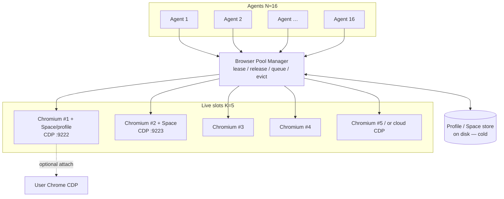

# ego-arch-pool-001 — Browser pool architecture for N≈16 agents / K≈5 live browsers

**Task id:** `ego-arch-pool-001`  
**Kind:** scout · **Project:** `ego-agent` · **Crew:** EgoArch / Firstmate  
**Date:** 2026-09-22 (Africa/Nairobi, EAT / UTC+3)  
**Primary question:** How do we support ~16 concurrent agents where only ~5 need live browsers at once, without wasting RAM/CPU — local and/or cloud?

**Captain hard constraints (2026-09-22):** CDP remote-drive of stock Chrome/Chromium (ego-browser / agent-browser / jev-ultrafast family). **NO** Electron, **NO** Chromium fork, **NO** TypeSafe Jev, **NO** Open-Jev. Laya is **not** a browser (optional later decision head only — not centered here). Isolated profiles = Spaces; optional attach to real Chrome. Evidence from peers + original design; cite paths/URLs; label estimates. Understanding only from ego-lite — no code theft.

---

## Executive recommendation

**MVP:** Run a **shared Browser Pool Service** that owns a hard cap of **K=5** live Chromium process trees (CDP endpoints). Agents (N≈16) never own a permanent browser process. They **lease** a browser slot (+ a Space/profile binding), drive it via CDP (or a thin harness over CDP), then **release**. Idle leases are soft-evicted; cold slots are started on demand; optionally keep **W=1–2 warm** empty Chromiums to cut cold-start latency.

**Process topology for MVP:** Prefer **one Chromium process tree per leased slot** (K separate browsers), each with **one primary Space** (dedicated `user-data-dir` / profile). Do **not** pack all 16 agents into one Chromium with many contexts for MVP — that densifies RAM poorly under site isolation and couples crash/abort domains. Contexts remain a useful *stretch* density trick *inside* a leased slot (multi-tab / multi-user scenarios), not a substitute for the K-cap pool.

**Local-first for MVP; cloud as overflow.** Local CDP wins for latency, privacy, and optional attach-to-real-Chrome. Cloud CDP providers (Browserbase / Browserless / Browser Use Cloud / Kernel / AgentCore — as wired by Vercel agent-browser) win when local RAM is exhausted, for burst >K, or for stealth/residential needs. Same lease API; different backend.

**Out of MVP scope:** Electron shell, CEF-in-Tauri, Chromium forks, TypeSafe Jev / Open-Jev, centering Laya. Decision heads (Laya / hosted Jev) plug in *above* the pool later.

---

## 1) Process models

Three viable CDP topologies (all keep stock Chrome/Chromium; no fork):

### A. One Chromium · many contexts (Playwright-style)

| | |
|---|---|
| **Shape** | Single `Browser` process tree; many `BrowserContext`s (incognito-like sessions) |
| **Isolation** | Cookies / localStorage / sessionStorage / permissions isolated per context ([Playwright Isolation](https://playwright.dev/docs/browser-contexts)) |
| **Not isolated** | Browser + GPU + some utility processes; crash of browser kills all contexts; site-isolation still spawns many renderers |
| **Density** | Best *state* density; RAM savings vs N full browsers, but **not** linear — renderers dominate |
| **Peer evidence** | Playwright contexts “fast and cheap”; Stagehand / many agent stacks use this pattern (`ego-peers-001` §4) |
| **Fit for N=16/K=5** | Good *inside* a leased slot; risky as the *only* global model if all agents share one process |

### B. Many Chromium processes (1 browser ≈ 1 agent)

| | |
|---|---|
| **Shape** | N independent Chromium trees, each with own CDP port + profile |
| **Isolation** | Strongest crash / fingerprint / profile boundary |
| **Cost** | Highest RAM/CPU; browser-use README explicitly calls out Chrome memory + parallel agents as hard → recommend Cloud for production scale (`ego-peers-001` §3) |
| **Fit** | Wrong as permanent N=16; correct as **the unit of a pool slot** (cap at K=5) |

### C. Shared browser service (pool / lease) — **recommended spine**

| | |
|---|---|
| **Shape** | Long-lived **Pool Manager** process; up to K Chromium children (or cloud CDP sessions); agents talk to manager, not to Chrome PIDs |
| **Peer analogues** | Vercel agent-browser **Rust daemon** persists across CLI commands; idle timeout default **1h**; sessions + `--pin-tab` for multi-session shared CDP ([agent-browser README](https://github.com/vercel-labs/agent-browser), [configuration](https://agent-browser.dev/configuration)); ego-lite **Spaces** + `createTaskSpace` / `useTaskSpace` / handoff (`ego-study-001` §3; `docs/native-bindings-api.md` in citrolabs/ego-lite) |
| **Fit** | Directly matches “16 agents, 5 live browsers” |



**ASCII (same topology):**

```text
Agents (N=16) ──lease/release──► Pool Manager ──owns──► ≤K Chromium CDP endpoints
                                      │
                                      ├── warm slots (W)
                                      ├── cold-start on demand
                                      ├── idle-evict → discard process, keep profile on disk
                                      └── overflow → cloud CDP provider
```

---

## 2) Memory budgets

**Labels:** *cited* = primary/public measurement or peer report; *estimate* = planning figure derived from cited ranges (not measured on Firstmate hardware).

### Cited Chrome / tab ranges

| Workload | Metric | Value | Source |
|---|---|---|---|
| Idle Wikipedia article | RSS / PSS | ~76 MB RSS · ~15 MB PSS | [superchargebrowser Chrome RAM 2026](https://www.superchargebrowser.com/library/chrome-ram-usage-per-tab-2026/) *(cited, third-party lab)* |
| Light feed (HN) | RSS | ~110 MB | same |
| Reddit / news+ads | RSS | ~183–354 MB | same |
| Google Docs / Gmail class | RSS | ~280–450 MB | same |
| YouTube 1080p | RSS | ~470–530 MB | same |
| Static page vs web app vs video (Mac mental model) | RSS-class | ~60–90 / 200–400 / 300–500 MB | [supasidebar Safari vs Chrome 2026](https://supasidebar.com/blog/safari-vs-chrome-ram-usage-mac-2026) *(cited, editorial)* |
| Site isolation overhead | relative | ~10–13% more memory vs pre-isolation | Chromium eng via same editorial *(cited secondhand)* |
| Summing per-process RSS | caveat | **Double-counts shared pages**; prefer PSS / Chrome Task Manager / Chromium `multi_process_rss` | [Chromium memory key concepts](https://chromium.googlesource.com/chromium/src/+/141.0.7390.122/docs/memory/key_concepts.md); [multi_process_rss.py](https://chromium.googlesource.com/chromium/src/+/6c261f975dbd134e9319c090c8f9dfba6ee34e06/tools/multi_process_rss.py) |
| Playwright long-lived contexts | observation | Memory grows if contexts not closed; community reports primary context hundreds of MB–1+ GB before close | [Playwright #15400](https://github.com/microsoft/playwright/issues/15400) *(cited, anecdotal)* |
| wrymium CEF-in-Tauri (peer, not recommended stack) | main-process | ~198 MB vs Electron ~285 MB on M2 Max | `ego-peers-001` §5.1 / wrymium README *(cited; CEF path out of constraints)* |

### Planning budgets for agent browsers *(estimates)*

Assume headless/headed automation with 1–3 active tabs on typical agent sites (docs, dashboards, search) — **not** idle articles, **not** continuous 1080p.

| Unit | Estimate (private-ish footprint) | Notes |
|---|---|---|
| Empty Chromium tree (browser+GPU+utility, no tabs) | **150–300 MB** | estimate; platform-dependent |
| + one light agent page | **+80–200 MB** | estimate from cited light/medium tabs |
| Typical **leased slot** (1 Space, 1–2 tabs, automation) | **400–800 MB** | estimate planning band |
| Heavy slot (SPA + media / many iframes) | **800 MB–1.5 GB** | estimate upper band |
| Pool at **K=5** typical | **~2.0–4.0 GB** | 5 × 400–800 MB estimate |
| Pool at K=5 heavy | **~4–7.5 GB** | estimate |
| Anti-pattern: **N=16 always-on** typical | **~6.4–12.8 GB** | estimate; wastes ~3–4× vs K=5 |
| Disk profile / Space (cold) | **tens–hundreds MB disk**, ~0 RAM until mounted | estimate; cookies/local state only |

**CPU:** Live headed Chromium + CDP screenshot/a11y loops are bursty; K=5 concurrent agents can saturate a few cores during snapshot storms. Pooling still wins because idle agents hold **zero** renderer cycles.

**Implication:** The K-cap is the primary RAM control. Context-packing inside one Chromium helps at the margin; it does not replace eviction.

---

## 3) Pool / lease / idle-evict / cold-start scheduling (K=5, N=16)

### Goals

1. At most **K=5** live Chromium trees (or cloud sessions) at once.  
2. Any of **N=16** agents can obtain a browser when capacity allows.  
3. Prefer **reuse** of warm empty slots over full cold starts.  
4. Never leave browsers running for agents that are thinking/LLM-bound without a need.

### State machine (per slot)

```text
FREE_COLD  --(acquire, no warm)--> STARTING --> LEASED --> RELEASING --> FREE_WARM
FREE_WARM  --(acquire)----------------------► LEASED
LEASED     --(idle TTL / soft-evict)--------► EVICTING --> FREE_COLD (profile kept on disk)
LEASED     --(hard error / OOM)-------------► DEAD --> (replace) STARTING | FREE_COLD
```

### Parameters *(recommended defaults — estimates / policy choices)*

| Parameter | MVP default | Rationale |
|---|---|---|
| `K` (max live) | **5** | Captain target |
| `W` (warm idle browsers) | **1–2** | Cut cold-start; cap idle RAM (~0.4–1.6 GB estimate) |
| Lease hard TTL | **15–30 min** | Prevent stuck agents; renew via heartbeat |
| Soft idle-evict | **2–5 min** without CDP traffic / heartbeat | Tighter than agent-browser’s **1h** daemon idle default ([config](https://agent-browser.dev/configuration)) because we share scarce slots across 16 agents |
| Queue wait | Fair FIFO; optional priority for interactive HITL | Prevent starvation |
| Cold-start budget | Allow acquire to block ≤ **T_cold** (estimate 2–8 s local Chrome-for-Testing) | Surface `starting` status to agent |
| Heartbeat interval | **15–30 s** | Lease renew |
| Profile bind | Space id fixed for lease duration | Matches ego `createTaskSpace(..., profileId)` semantics (`ego-study-001` §3–4) |

### Scheduling rules

1. **Acquire(spaceId, mode):**  
   - If agent already holds a lease → return same handle (idempotent).  
   - Else if FREE_WARM available → bind Space profile (or create context) → LEASED.  
   - Else if live < K → cold-start Chromium with that Space’s `user-data-dir` → LEASED.  
   - Else enqueue; optionally offer **cloud overflow** if enabled.  
2. **Release:** detach CDP clients; optionally clear non-persistent context; move slot to FREE_WARM if `live_warm < W`, else kill process → FREE_COLD (profile remains on disk).  
3. **Idle-evict:** if LEASED and no heartbeat/CDP for soft idle → force Release with reason `idle_evicted` (agent must re-acquire).  
4. **Preempt (stretch):** allow higher-priority HITL acquire to soft-evict lowest-priority idle lease after grace period.  
5. **Pin / attach modes:** `mode=isolated` (default), `mode=attach_user_chrome` (exclusive lease on user’s CDP; never warm-pooled with others — aligns with agent-browser `--pin-tab` / attach semantics, `ego-peers-001` §2).

### Peer anchors

- agent-browser: persistent daemon; `AGENT_BROWSER_IDLE_TIMEOUT_MS` default **3600000**; headed & user-attached exempt from *default* idle cleanup; **provider-owned cloud browsers are eligible** ([configuration](https://agent-browser.dev/configuration)).  
- ego-lite Spaces: create / use / close / complete / handOff / takeOver — ownership `agent` | `user`; mutating APIs blocked when user-in-control (`EGO_TASK_SPACE_USER_IN_CONTROL`) (`ego-study-001` §3).  
- browser-use: scale → Cloud when Chrome RAM hurts (`ego-peers-001` §3).

---

## 4) Profile / Space isolation vs cookie / login sharing risks

### Mapping: Space ≈ isolated profile

| Concept | ego-lite (cited) | Pool MVP |
|---|---|---|
| Space | `createTaskSpace(name, profileId?)` → id; profile fixed at creation | Space record on disk: `{id, profilePath, ownership, cookies…}` |
| Select | `useTaskSpace(id)` local to invocation | Lease binds agent ↔ Space ↔ live slot |
| Profiles | `listProfiles()` → Default / Profile N; Chrome import is **closed app UX**, not open harness logic (`ego-study-001` §4) | Optional import/copy of Chrome profile **into** a Space path (product decision); never silently share |
| Clearing | Some CDP clears are **profile-wide** (`references/clearing-state.md` noted in ego-study) | Document which APIs are Space-scoped vs process-scoped |

### Isolation levels

| Level | Mechanism | Cookie/login isolation | Risk |
|---|---|---|---|
| **L0 Shared context** | Same context / same tabs | **None** — full share | Agents steal sessions; XSS/automation crosstalk |
| **L1 Playwright context** | `browser.newContext()` / CDP Target createBrowserContext | Strong cookie/storage isolation in one browser | Shared process crash domain; some fingerprint sameness |
| **L2 Dedicated user-data-dir** | Separate Chromium `--user-data-dir=…/spaces/{id}` | Strongest practical login isolation | Higher RAM per slot (desired unit of K-pool) |
| **L3 Attach real Chrome** | `--remote-debugging-port` / agent-browser `--auto-connect` | **Shares human cookies/extensions** by design | Highest blast radius; require exclusive lease + user consent |

### Sharing policy (MVP recommendation)

1. **Default:** L2 — each Space owns a directory; lease mounts it into one Chromium.  
2. **Allow L1** only *within* one agent’s lease (multi-role tests), never across agents.  
3. **L3 attach:** explicit capability + captain/user gate; pin-tab; no pool reuse of that CDP endpoint with other agents.  
4. **Never** put two agents on one Space unless one has handed off (ego `handOffTaskSpace` / `takeOverTaskSpace` pattern).  
5. **Cloud profile sync caveat:** browser-use Cloud syncs cookies, **not** localStorage / IndexedDB / extensions (`ego-peers-001` §3) — do not assume full Space fidelity in cloud overflow.

---

## 5) Local vs cloud browser backends

| Dimension | Local CDP (Chrome / Chrome-for-Testing) | Cloud CDP (Browserbase, Browserless, Browser Use Cloud, Kernel, AgentCore, …) |
|---|---|---|
| **When it wins** | Dev/MVP; low latency; privacy; attach to real Chrome; fixed K≤5 fits RAM | Burst >K; CI agents without GUI hosts; stealth/residential; ops doesn’t want Chrome installs |
| **Latency** | Process-local WebSocket | Network RTT + provider queue |
| **RAM on box** | Pays full K budget | Near-zero local browser RAM; pay $ / browser-hour |
| **Peer evidence** | agent-browser default local; `--cdp` / `--auto-connect`; browser-use `from_system_chrome()` | agent-browser `-p browserbase|browseruse|kernel|browserless|agentcore`; Browserless TTL example **300000 ms** ([docs](https://docs.browserless.io/ai-integrations/agent-browser)) |
| **HITL** | Headed window / stream on LAN | Live View URL (treat as **credential** — browser-use docs, `ego-peers-001`) |
| **Constraints fit** | Stock Chromium + CDP — yes | Still CDP remote-drive — yes; no Electron/fork required |

**MVP policy:** Local pool primary; cloud as **overflow backend** behind the same lease API when queue wait > threshold or host memory pressure. Stretch: pin specific Spaces to cloud (anti-bot targets).

---

## 6) Multi-agent API sketch (request / release without owning a process)

Transport: UNIX socket or localhost HTTP/JSON (implementation-flexible). Auth: per-agent token. Agents speak this API; **only the pool** launches Chrome.

### Endpoints (sketch)

```text
POST /v1/leases
  body: {
    agent_id: string,
    space_id: string,          # Space / profile binding
    mode: "isolated" | "attach_user_chrome",
    backend: "local" | "cloud" | "auto",
    ttl_seconds?: number,
    priority?: "normal" | "interactive"
  }
  → 200 {
    lease_id, status: "leased"|"starting"|"queued",
    cdp_url?,                # ws://127.0.0.1:PORT/devtools/... when ready
    space_id, slot_id?,
    queue_position?, eta_ms?
  }

GET  /v1/leases/{lease_id}     → status, cdp_url, expires_at
POST /v1/leases/{lease_id}/heartbeat
POST /v1/leases/{lease_id}/release   body: { reason?: string }

GET  /v1/pool                  → { K, W, live, warm, queued, backends }
POST /v1/spaces                → create Space { name, profile_source? }
GET  /v1/spaces/{id}
```

### Agent usage pattern

```text
1. lease = POST /v1/leases { space_id, mode: isolated, backend: auto }
2. poll until status == leased && cdp_url
3. drive via CDP (ego-browser-style harness / agent-browser --cdp / Playwright connectOverCDP)
4. heartbeat while working
5. POST .../release  (even on agent crash: lease TTL + idle-evict reclaim)
```

Agents **must not** spawn `chromium --remote-debugging-port` themselves in MVP. That breaks the K-cap.

Optional thin wrapper (conceptual — not ego-lite code):

```text
async with pool.browser(space_id="task-42") as b:
    page = await b.open("https://…")
    snap = await b.snapshot()
# release automatic
```

---

## 7) Recommended architecture — MVP + stretch

### MVP (ship this)

1. **Pool Manager** service with K=5, W=1–2, lease/heartbeat/idle-evict as in §3.  
2. **Backend:** local Chrome-for-Testing / system Chromium via CDP; one process tree per slot; Space = `user-data-dir`.  
3. **Driver:** existing CDP harness family patterns (agent-browser daemon ideas, browser-harness/CDP, ego-browser *concepts* only — MIT patterns, no proprietary ego-lite binary).  
4. **API:** §6 lease/release; agents never own PIDs.  
5. **Modes:** `isolated` default; `attach_user_chrome` gated.  
6. **Observability:** pool gauges (live/warm/queued), per-slot RSS via OS or Chrome Task Manager sampling *(measure on Firstmate box before locking K)*.  
7. **Explicitly not in MVP:** Electron, CEF/Tauri embed, Chromium fork, TypeSafe Jev, Open-Jev, Laya-as-browser, packing all agents into one Chromium.

**Tradeoffs (MVP):**  
(+) Clear RAM ceiling; matches peer “daemon + CDP” and ego Spaces; simple failure domains.  
(−) Cold-start latency; queueing under load; less dense than pure multi-context; need careful profile file locking (one live mount per Space).

### Stretch

| Stretch | Value | Tradeoff |
|---|---|---|
| Cloud overflow behind `backend: auto` | Survive >K / low-RAM hosts | Cost; cookie fidelity gaps |
| L1 contexts *inside* a leased L2 slot | Multi-account flows per agent | Complexity; still one crash domain |
| Warm profile snapshot / `storageState` restore | Faster Space revive without full disk profile | Partial state vs full profile |
| Preempt + priority leases | HITL responsiveness | Starvation risk if mis-tuned |
| Optional **Laya** (or other) decision head *above* pool | Faster choose/act loops (`ego-decision-001`) | **Not** part of browser pool; GPU/API cost separate |
| Pair-browse stream (agent-browser WS / cloud Live View) | Human watch/takeover | Security of stream URLs |

### Topology choice summary

| Option | MVP? | Verdict |
|---|---|---|
| A · 1 Chromium many contexts only | No as global | Stretch density *inside* slot |
| B · N permanent Chromiums | No | Waste; browser-use warns |
| C · Shared pool leasing ≤K Chromiums | **Yes** | Primary recommendation |

---

## 8) Open questions for captain

1. **Hard K vs soft K:** Is 5 a hard RAM fence on the target machine, or may cloud overflow make effective concurrency >5?  
2. **Warm pool W:** Prefer W=0 (min RAM) or W=2 (min latency)? Need a measured cold-start on the intended host.  
3. **Space storage:** Full Chromium `user-data-dir` per Space vs Playwright `storageState` cookies-only — which fidelity is required for “import Chrome logins”?  
4. **Attach-to-real-Chrome:** In or out of MVP? Exclusive lease UX + consent model?  
5. **Driver pick:** Standardize on Vercel agent-browser CDP CLI, Playwright `connectOverCDP`, browser-harness, or a thin in-house CDP client — still stock Chromium either way.  
6. **Idle TTL numbers:** Confirm 2–5 min soft-evict vs longer for LLM-think gaps (agents may hold lease while waiting on model).  
7. **Memory measurement protocol:** Before locking budgets, run Firstmate sample: PSS/RSS for 1 idle automation Chromium + 1 typical task page on the real box (cited blog numbers are not our hardware).  
8. **Linux ship target:** ego-lite product is macOS-first / Linux roadmap (`ego-study-001` §6) — our pool should assume Linux agents on the box; confirm Chrome-for-Testing install path.  
9. **Decision head:** Defer Laya entirely, or schedule a parallel “optional System-1” spike that **must not** reshape the pool API?  
10. **Multi-tenant security:** Are all 16 agents same-trust (one user) or hostile-tenant? Latter forces L2 + no shared browser process ever.

---

## Sources

### Prior Firstmate reports (read fully)

- `/home/box/agent-data/firstmate/reports/ego-study-001.md`
- `/home/box/agent-data/firstmate/reports/ego-peers-001.md`
- `/home/box/agent-data/firstmate/reports/ego-decision-001.md`
- `/home/box/agent-data/firstmate/reports/egostudy-first-recon-001.md`
- Workspace mirrors under `/workspace/ego-*.md`

### Public / peer citations

- Playwright Isolation (BrowserContext): https://playwright.dev/docs/browser-contexts  
- Vercel agent-browser: https://github.com/vercel-labs/agent-browser ; https://agent-browser.dev/configuration ; https://agent-browser.dev/cdp-mode  
- Browserless + agent-browser: https://docs.browserless.io/ai-integrations/agent-browser  
- Chrome tab RAM lab (2026): https://www.superchargebrowser.com/library/chrome-ram-usage-per-tab-2026/  
- Chromium memory concepts: https://chromium.googlesource.com/chromium/src/+/141.0.7390.122/docs/memory/key_concepts.md  
- Playwright memory discussion: https://github.com/microsoft/playwright/issues/15400  
- citrolabs/ego-lite public docs paths as cited in ego-study (Spaces, profiles, CDP) — understanding only  
- Notes repo (searched; no extra pool design hits): https://github.com/MubarakHimself/ego-agent-notes  

### Explicitly not recommended / out of constraints

- Electron desktop shell  
- Chromium forks / CEF-as-product path (wrymium noted as peer evidence only)  
- TypeSafe Jev / Open-Jev as pool dependencies  
- Laya as a browser runtime  

---

*End of ego-arch-pool-001. Decision-ready for captain: shared CDP browser pool, K=5 live slots, Space=profile isolation, local-first + cloud overflow.*
